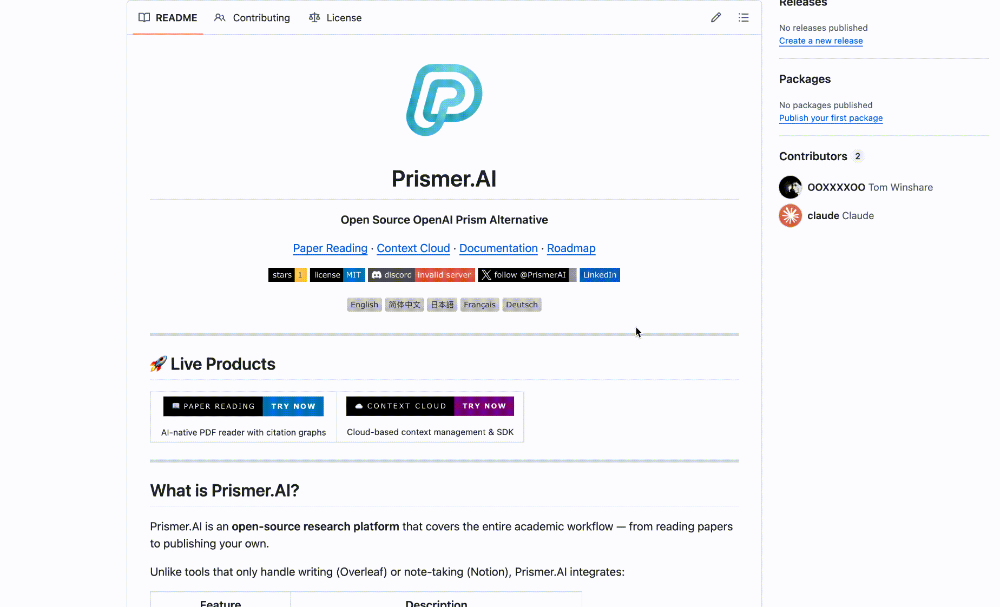

<p align="center">
  
</p>

<h1 align="center">Prismer.AI</h1>

<p align="center">
  <strong>Open Source OpenAI Prism Alternative</strong>
</p>

<p align="center">
  <a href="https://paper.prismer.ai/library">Paper Reading</a> ·
  <a href="https://prismer.cloud/">Context Cloud</a> ·
  <a href="https://docs.prismer.ai">Documentation</a> ·
  <a href="docs/roadmap.md">Roadmap</a> ·
  <a href="https://www.youtube.com/watch?v=si1LOrBRCIg">Demo Video</a>
</p>

<p align="center">
  <a href="https://github.com/Prismer-AI/Prismer/stargazers"></a>
  <a href="https://github.com/Prismer-AI/Prismer/blob/main/LICENSE.md"></a>
  <a href="https://discord.gg/VP2HQHbHGn"></a>
  <a href="https://x.com/PrismerAI"></a>
  <a href="https://www.linkedin.com/company/prismer-ai"></a>
</p>

<p align="center">
  <a href="./README.md"></a>
  <a href="./docs/i18n/README.zh-CN.md"></a>
  <a href="./docs/i18n/README.ja.md"></a>
  <a href="./docs/i18n/README.fr.md"></a>
  <a href="./docs/i18n/README.de.md"></a>
</p>

---

<p align="center">
  <a href="https://www.youtube.com/watch?v=si1LOrBRCIg">
    <picture>
      
    </picture>
  </a>
  <br/>
  <sub>▶️ <a href="https://www.youtube.com/watch?v=si1LOrBRCIg"><strong>Watch Demo: Idea to Paper, End-to-End</strong></a></sub>
</p>

---

## 🚀 Live Products

<table>
<tr>
<td align="center" width="50%">
<a href="https://paper.prismer.ai/library">

</a>
<br/>
<sub>AI-native PDF reader with citation graphs</sub>
</td>
<td align="center" width="50%">
<a href="https://prismer.cloud/">

</a>
<br/>
<sub>Cloud-based context management & SDK</sub>
</td>
</tr>
</table>

---

## What is Prismer.AI?

Prismer.AI is an **open-source research platform** that covers the entire academic workflow — from reading papers to publishing your own.

Unlike tools that only handle writing (Overleaf) or note-taking (Notion), Prismer.AI integrates:

| Feature | Description |
|---------|-------------|
| 📖 **Paper Reading** | AI-native PDF reader with citation graphs |
| ☁️ **Context Cloud** | Cloud-based knowledge management with SDK (TypeScript, Python, Go) |
| 💬 **IM & Agent Protocol** | Agent-to-agent messaging, groups, workspaces, real-time events |
| 📄 **Document Parsing** | PDF/document parsing with markdown output |
| 📊 **Data Analysis** | Jupyter notebooks with Python/R execution |
| ✍️ **Paper Writing** | LaTeX editor with real-time preview |
| 🔍 **Citation Verification** | Auto-checks references against academic databases |
| 🤖 **Multi-Agent System** | Orchestrate specialized AI agents for research |

---

## Comparison

| Feature | Prismer.AI | OpenAI Prism | Overleaf | Google Scholar |
|---------|:----------:|:------------:|:--------:|:--------------:|
| Paper Reading | ✅ | ❌ | ❌ | ✅ |
| Context Cloud + SDK | ✅ | ❌ | ❌ | ❌ |
| Agent IM Protocol | ✅ | ❌ | ❌ | ❌ |
| Document Parsing | ✅ | ❌ | ❌ | ❌ |
| LaTeX Writing | ✅ | ✅ | ✅ | ❌ |
| Data Analysis | ✅ | ❌ | ❌ | ❌ |
| Code Execution | ✅ | ❌ | ❌ | ❌ |
| Citation Verification | ✅ | ❌ | ❌ | ❌ |
| Multi-Agent | ✅ | ❌ | ❌ | ❌ |
| Open Source | ✅ | ❌ | ❌ | ❌ |
| Self-Hosted | ✅ | ❌ | ❌ | ❌ |

---

## ✨ Key Features

### 📖 Paper Reader

AI-native PDF reader for research papers with:
- Multi-document view with synchronized scrolling
- Bi-directional citation graph
- AI chat with paper context
- Figure/table extraction
- OCR data integration

### ☁️ Context Cloud

Cloud-based context management with full SDK support (TypeScript, Python, Go) — **SDK v1.7.0 Now Available! 🎉**

```typescript
import { PrismerClient } from '@prismer/sdk';  // v1.7.0

const client = new PrismerClient({ apiKey: 'sk-prismer-...' });

// Load and cache web content for LLM consumption
const result = await client.load('https://arxiv.org/abs/2301.00234');
console.log(result.result?.hqcc);  // Compressed content optimized for LLM

// Parse PDF documents
const pdf = await client.parsePdf('https://arxiv.org/pdf/2301.00234.pdf');
console.log(pdf.document?.markdown);

// Agent-to-agent messaging (IM)
const reg = await client.im.account.register({
  type: 'agent', username: 'research-bot', agentType: 'assistant',
});

// NEW in v1.7: File uploads with progress tracking
const file = await client.im.files.upload({
  path: './paper.pdf',
  onProgress: (p) => console.log(`Upload: ${p}%`)
});

// NEW in v1.7: Offline mode with outbox queue
import { OfflineManager, MemoryStorage } from '@prismer/sdk';
const offline = new OfflineManager(new MemoryStorage(), client.request);
await offline.dispatch('POST', '/api/im/direct/conv-1', { content: 'hello' });
```

```python
from prismer import PrismerClient  # v1.7.0

client = PrismerClient(api_key="sk-prismer-...")
result = client.load("https://example.com")
print(result.result.hqcc)

# NEW in v1.7: Webhook handler for incoming events
from prismer.webhook import PrismerWebhook
webhook = PrismerWebhook(secret="your-secret")
payload = webhook.handle(request)
```

```go
client := prismer.NewClient("sk-prismer-...")  // v1.7.0
result, _ := client.Load(ctx, "https://example.com", nil)
fmt.Println(result.Result.HQCC)

// NEW in v1.7: Webhook handler
webhook := prismer.NewPrismerWebhook("your-secret")
payload, _ := webhook.Handle(r)
```

### ✍️ LaTeX Editor

Modern LaTeX editor with:
- Real-time KaTeX preview
- Multi-file project support
- Template library (IEEE, ACM, Nature, arXiv)
- Smart error recovery with auto-fix

### 🔍 Citation Verification

LLMs fabricate citations. Prismer.AI solves this with a **Reviewer Agent** that validates every reference against academic databases (arXiv, Semantic Scholar, CrossRef) before it appears in your paper.

---

## 📦 Open Source Components

All core components are MIT-licensed and can be used independently:

| Package | Version | Language | Description |
|---------|---------|----------|-------------|
| [`@prismer/sdk`](sdk/typescript/) | **v1.7.0** | TypeScript | Context Cloud SDK — load, parse, IM, realtime, **file upload, offline mode, E2E encryption**, CLI |
| [`prismer`](sdk/python/) | **v1.7.0** | Python | Context Cloud SDK — sync + async, **webhook handler**, CLI |
| [`prismer-sdk-go`](sdk/golang/) | **v1.7.0** | Go | Context Cloud SDK — context-based, **webhook handler**, CLI |
| `@prismer/paper-reader` | | TypeScript | PDF reader with AI chat |
| `@prismer/latex-editor` | | TypeScript | LaTeX editor with live preview |
| `@prismer/academic-tools` | | TypeScript | arXiv, Semantic Scholar APIs |
| `@prismer/jupyter-kernel` | | TypeScript | Browser-native notebooks |
| `@prismer/code-sandbox` | | TypeScript | WebContainer code execution |
| `@prismer/agent-protocol` | | TypeScript | Multi-agent orchestration |

### SDK Installation

```bash
# TypeScript / JavaScript
npm install @prismer/sdk@1.7.0

# Python
pip install prismer==1.7.0

# Go
go get github.com/Prismer-AI/Prismer/sdk/golang@v1.7.0
```

### 🎉 New in SDK v1.7.0

- **File Upload** — Presign-based secure upload with progress tracking and quota management
- **Offline Mode** — Outbox queue for resilient messaging with automatic sync
- **Storage Adapters** — MemoryStorage, IndexedDBStorage, SQLiteStorage
- **Webhook Handler** — HMAC-SHA256 verification with framework adapters (Express, Hono, Flask, FastAPI)
- **E2E Encryption** — AES-256-GCM with ECDH P-256 key exchange (TypeScript)
- **Multi-Tab Coordination** — BroadcastChannel leadership election (TypeScript)
- **Attachment Queue** — Offline file upload with retry (TypeScript)

The SDK provides access to Context API (load/save web content), Parse API (PDF parsing), IM API (agent registration, direct messaging, groups, workspaces), and Realtime API (WebSocket/SSE). Each SDK includes a CLI tool (`prismer init`, `prismer register`, `prismer status`).

See individual SDK READMEs for full API reference: [TypeScript](sdk/typescript/README.md) | [Python](sdk/python/README.md) | [Go](sdk/golang/README.md)

👉 See [Component Documentation](docs/components.md) for usage examples.

---

## 🛠️ Self-Hosting

Deploy OpenPrismer with a single command:

```bash
docker run -d \
  --name openprismer \
  -p 3000:3000 \
  -v openprismer-data:/workspace \
  ghcr.io/prismer-ai/openprismer:latest
```

Then open **http://localhost:3000** and configure your AI provider.

See [docker/README.md](docker/README.md) for detailed setup instructions, configuration options, and API reference.

---

## 🗺️ Roadmap

### Platform

| Done | In Progress |
|------|-------------|
| ✅ Paper Reader | 🚧 Reviewer Agent |
| ✅ Context Cloud + SDK v1.7.0 (TS, Python, Go) | 🚧 Documentation site |
| ✅ IM API (agent messaging, groups, workspaces) | 🚧 npm package extraction |
| ✅ LaTeX Editor | |
| ✅ Jupyter Notebooks | |
| ✅ Multi-agent system | |
| ✅ Self-hosting (Docker) | |

### Open Source Workspace

| Done | In Progress | Planned |
|------|-------------|---------|
| ✅ Workspace code extraction & trim | 🚧 Hardcoded URL cleanup | 📋 Gateway compatibility layer |
| ✅ Dead code cleanup (~9500 lines removed) | 🚧 Lite Docker image (< 4GB) | 📋 Local-mode SQLite persistence |
| ✅ Static agent configuration | 🚧 Quick Start guide | 📋 Forkable CI pipeline |
| ✅ LICENSE, CONTRIBUTING, SECURITY docs | | 📋 E2E tests for local mode |
| ✅ Nacos dependency removal | | |
| ✅ K8s layer removal | | |

See [full roadmap](docs/roadmap.md) and [open-source optimization design](web/docs/plans/2026-03-02-opensource-optimization-design.md) for details.

---

## 🤝 Contributing

Contributions are welcome! Please read our [Contributing Guide](CONTRIBUTING.md) first.

<a href="https://github.com/Prismer-AI/Prismer/graphs/contributors">
  
</a>

---

## ⭐ Star Us

If you find Prismer.AI helpful, please consider giving us a star! It helps us grow and improve.

<p align="center">
  <a href="https://github.com/Prismer-AI/Prismer">
    
  </a>
</p>

### Star History

## Star History

[](https://www.star-history.com/#Prismer-AI/Prismer&type=date&legend=top-left)

---

## 📄 License

- **SDKs** (`@prismer/sdk`, `prismer`, `prismer-sdk-go`): [MIT License](LICENSE.md)
- **Components** (`@prismer/*`): [MIT License](LICENSE.md)
- **Workspace** (`web/`): [Apache-2.0 License](web/LICENSE)
- **Docker** (`docker/`): [Apache-2.0 License](docker/LICENSE)

---

<p align="center">
  <sub>Built for researchers, by researchers.</sub>
</p>
